# SEGUNDO PARCIAL ADSI
* Tutorial Para examen de ADSI
--Por [Emiliano Sotomayor](https://uboat46.com/).

## Instrucciones
> Indice

- [Creando y Clonando un repositorio](#crear_y_clonar_un_repositorio)
- [Creando y resolviendo un merge conflict](#crear_y_resolver_un_merge_conflict)
- [Creando un Proyecto Maven](#crear_un_proyecto_maven)

### Crear_y_Clonar_un_repositorio

1. Desde github, una vez loggeado, en la parte superior derecha dar click a "New Repository"


2. Rellenar todos los campos pertinentes al nuevo repositorio. (Agregar opción de "Initialize this repository with a README")


3. Una vez creado el repositorio, copiar el url del mismo encontrado la parte derecha bajo "Clone or download" 


3. Desde una terminal teclear.

````
git clone <URL QUE ACABA DE SER COPIADO>
````

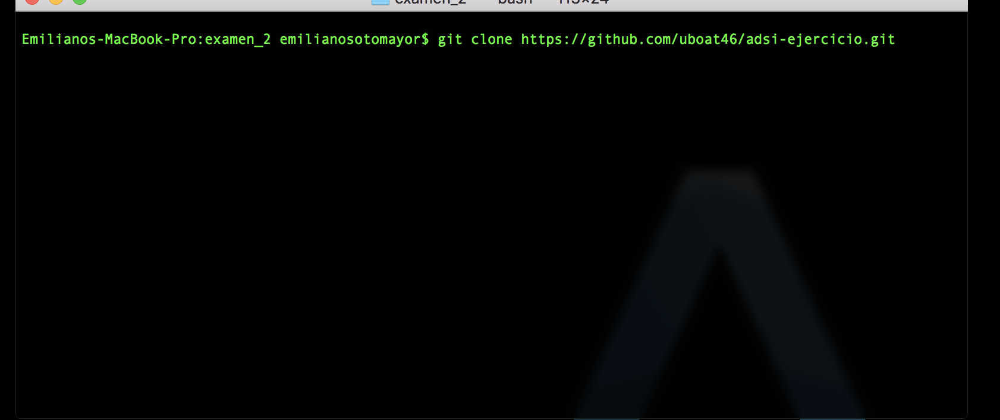

### Crear_y_Resolver_un_Merge_Conflict

1. Añadir un archivo dónde crear el merge conflict
    1. Bajar el archivo [pom.xml](./resources/pom.xml) y agregarlo al repositorio
    2. Una vez que el [pom.xml](./resources/pom.xml) esté en el repositorio teclear lo siguiente en una terminal

    Checamos que se ha creado un cambio en el repositorio
    ````
    git status
    ````
    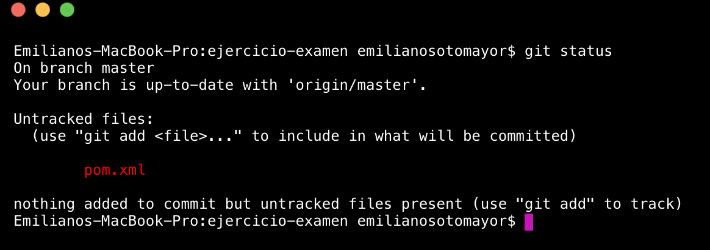

    Añadimos los cambios a nuestro repositorio
    ````
    git add .
    git commit -m "added pom.xml"
    ````
    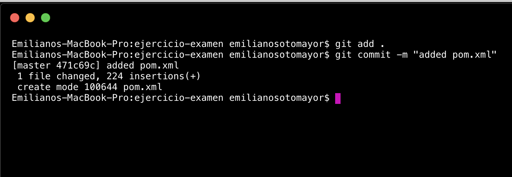

    Subimos los cambios a nuestro repositorio
    ````
    git push
    ````
    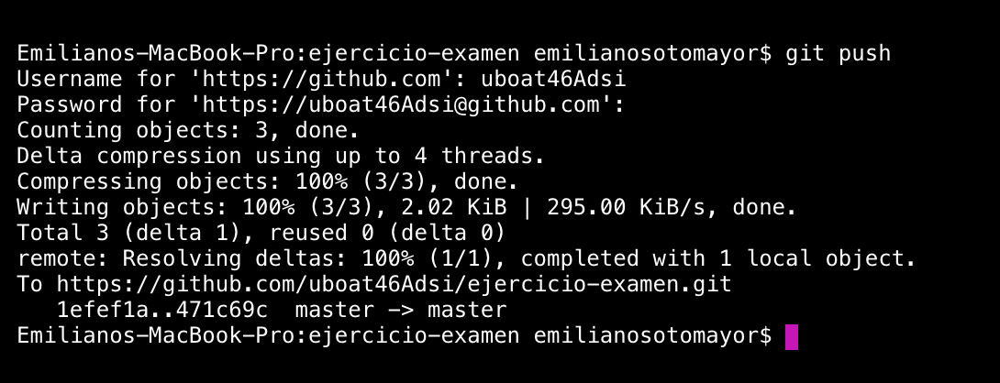

2. Salimos del repositorio y volvemos a clonarlo en otra carpeta para empezar a crear el merge conflict

````
cd ..
mkdir persona2
cd persona2
git clone <URL DEL REPOSITORIO>
````
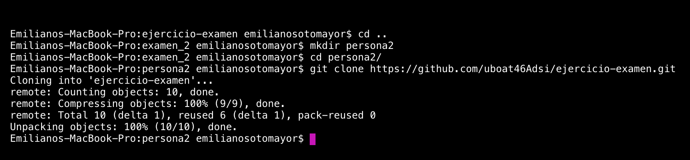

3. Modificamos pom.xml en persona2

````
nano pom.xml
````
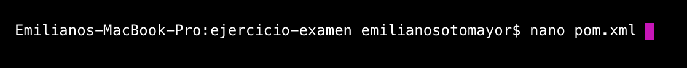

4. Modificar 7018 por 2018 y presionar 'ctrl-x'. Hasta abajo saldra un mensaje sobre si realizar los cambios.

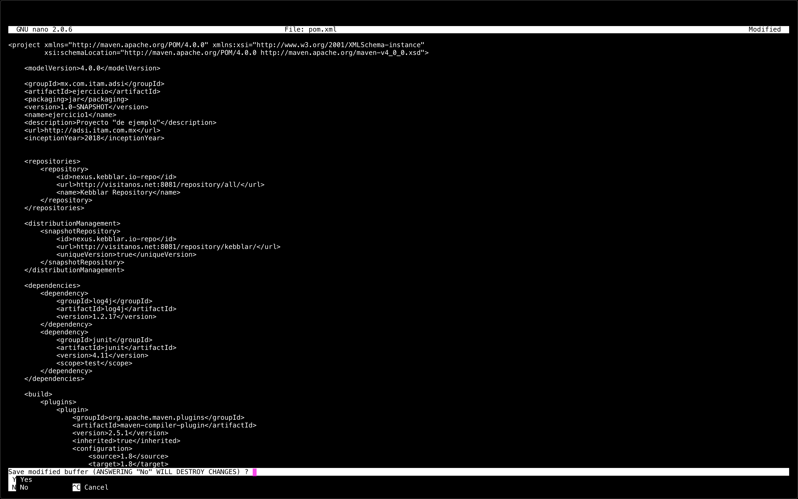

5. Presionar 'Y' y saldrá un mensaje sobre el nombre el nombre del archivo, presionar 'Enter'

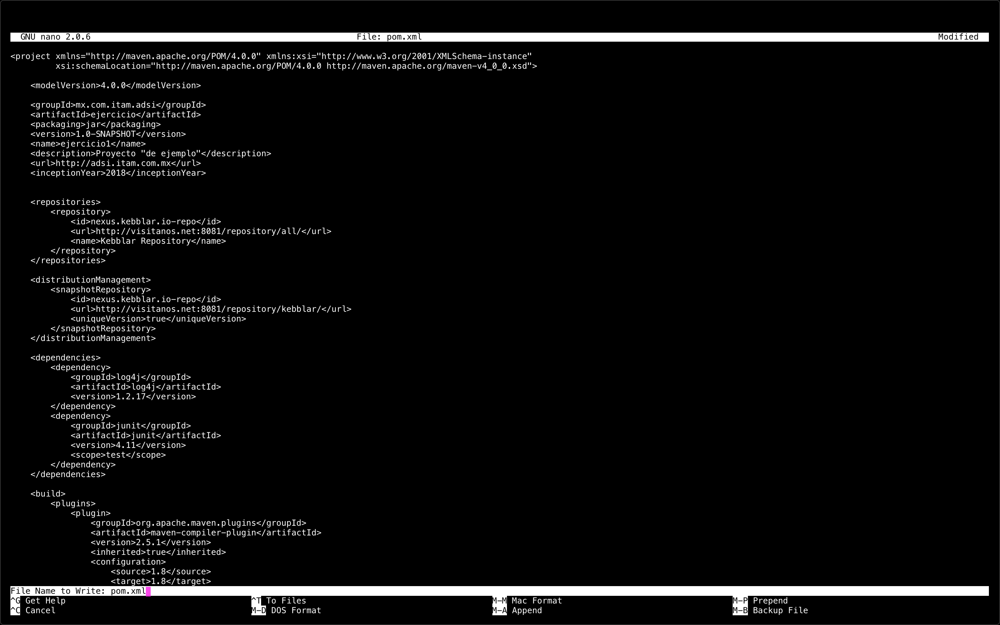

6. Realizar los mismos pasos del punto 1.ii. para subir los cambios al repositorio

7. Moverse al primer directorio que clonamos

````
cd ..
cd ..
cd <NOMBRE DEL DIRECTORIO>
````

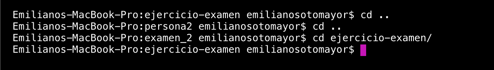

8. Modificar el pom.xml de la misma manera que realizamos en el paso 3, solo que cambiar la fecha por algo distitno a lo que agregamos en el punto 3

9. Intentar subir los cambios como visto en el paso 1, al momento de llegar a
````
git push
````
saldrá el siguiente mensaje de error

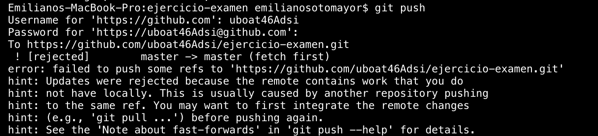

10. Realizamos

````
git pull
````
saldrá el siguiente mensaje de error

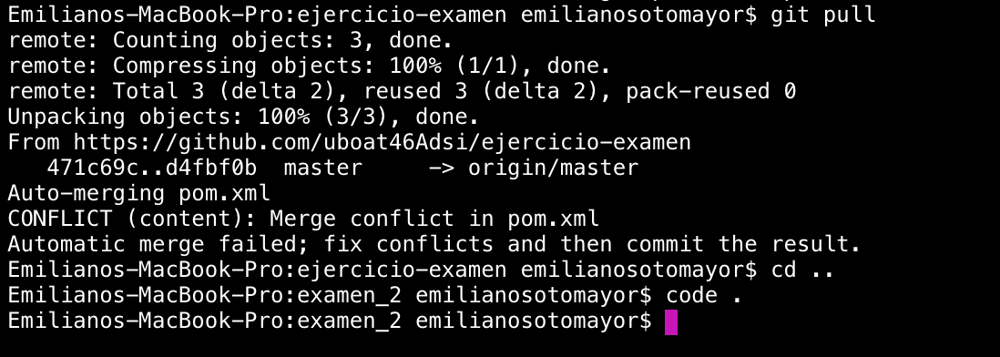

11. Entramos a modificar el archivo con cualquier editor que prefieran

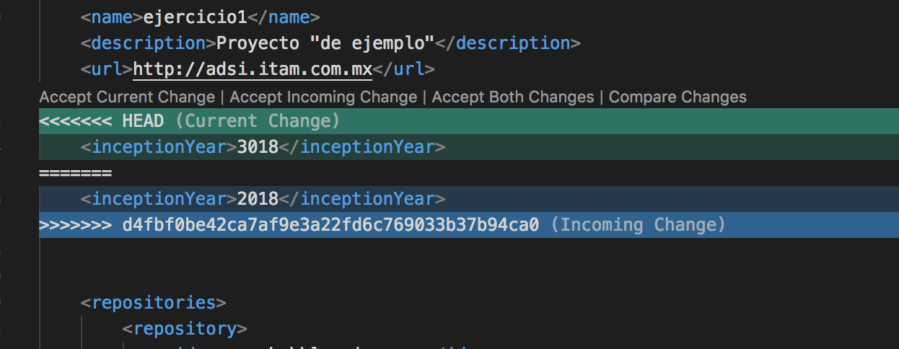

12. Corregimos el archivo por la fecha que más adecuada creamos

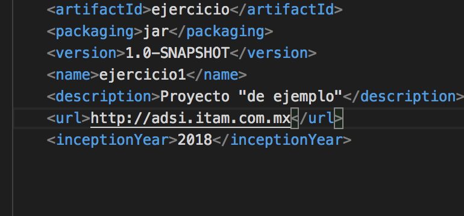

13. Volvemos a hacer todos los pasos para subir nuestros cambios.

14. [X] Resolver un merge conflict 


### Crear_un_Proyecto_Maven

#### Creando la estructura del proyecto

1. En el repositorio desde una terminal teclear

````
mkdir -p src/main/java/mx/com/itam/adsi/ejercicio/
mkdir -p src/main/resources
mkdir -p src/test/java/mx/com/itam/adsi/ejercicio/
mkdir -p src/test/resources
````

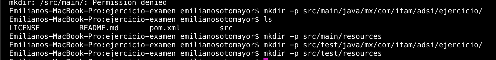

2. Teclear lo siguiente para crear nuestra clase java, y usando cualquier editor codificar la clase java a utilizar

````
touch src/main/java/mx/com/itam/adsi/ejercicio/Principal.java
````
3. Hacer los pasos para subir los archivos al repositorio (git add, commit, push)

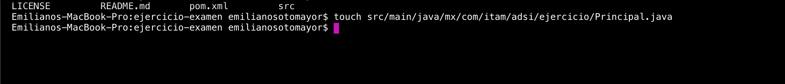

4. Agregar los siguientes [archivos](./resources/resources/) a ./main/resources/

5. Probar maven tecleando los sisguientes comandos en la terminal

````
mvn package
````


6. Se creara un directorio target, probar nuestro archivo .jar recientemente creado con

````
java -jar target/ejercicio-1.0-SNAPSHOT.jar
````

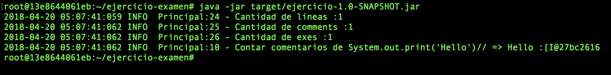


 ---Emiliano Sotomayor (uboat46)--- 


