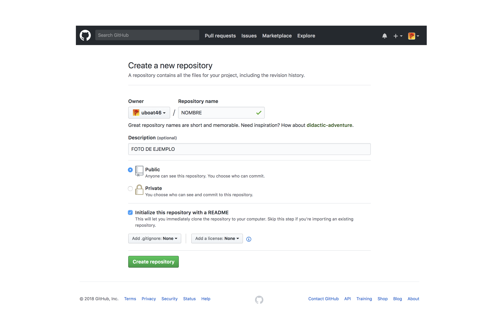
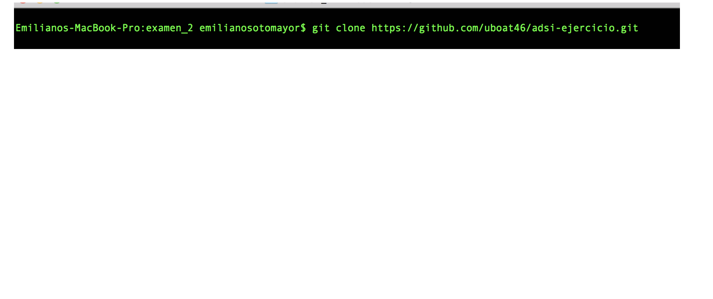

# SEGUNDO PARCIAL ADSI
* Tutorial Para examen de ADSI
--Por [Emiliano Sotomayor](https://uboat46.com/).

## Instrucciones
> Indice

- [Creando y Clonando un repositorio](#crear_y_clonar_un_repositorio)

### Crear_y_Clonar_un_repositorio

1. Desde github, una vez loggeado, en la parte superior derecha dar click a "New Repository"


2. Rellenar todos los campos pertinentes al nuevo repositorio. (Agregar opción de "Initialize this repository with a README")



3. Una vez creado el repositorio, copiar el url del mismo encontrado la parte derecha bajo "Clone or download" 


3. Desde una terminal teclear.

````
git clone <URL QUE ACABA DE SER COPIADO>
````



 ---Emiliano Sotomayor (uboat46)--- 


